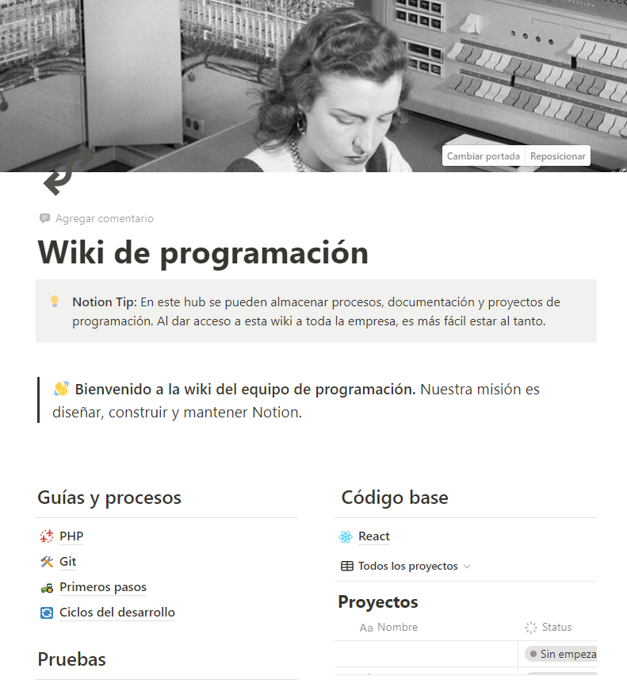

# Explorando PHP

Durante mis días de descanso, he dedicado tiempo a estudiar PHP e intentar escribir código. Algunos de los temas que he explorado incluyen:

- **Repasar lo básico**: Estaba muy perdida<¿¿???>.
- **Conexión con bases de datos**: Intenté entender qué tenemos que hacer en el proyecto, no lo conseguí.
- **Desarrollo web con PHP**: Buenas prácticas y típicos vídeos de youtube.

¡Estoy emocionado por las posibilidades que PHP ofrece y ansioso por seguir aprendiendo!

## Notion

También he intentado organizarme, dando mis primeros pasos con Notion y desarrollando una wiki de programación con lo que voy aprendiendo.

